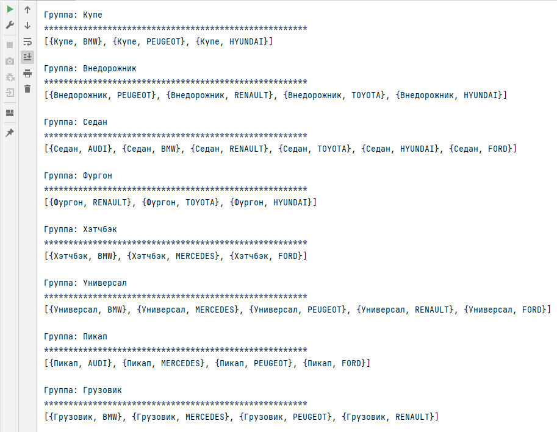

##Группировка списка автомобилей

Созданы два Enam: CarType и CarModel.

CarType содержит список типов автомобилей (SEDAN, HATCHBACK, SUV и т.д.). 
Для лучшего отображения добавлено поле перевода значения ("Седан", "Хэтчбэк",
"Внедорожник" и т.д.).

CarModel содержит список моделей (TOYOTA, FORD, RENAULT...). Т.к. наименования 
большинству пользователей понятны, без перевода значения. Для лучшего отображения в класс Utils
добавлена функция перевода значения в нижний регистр с первой заглавной буквой.
Класс Utils реализован финальным классом с закрытым конструктором и статическими 
методами.

Класс Car содержит два поля с типами из вышеуказанных перечислений.
Переопределены методы equals, hashCode, compareTo и toString.

В классе запуска приложения Main парк заполняется (коллекция Set) половиной 
возможных комбинаций типов и моделей автомобилей.
Т.е. от запуска к запуску парки автомобилей будут отличаться.
Т.к. коллекцией выбран TreeSet, парк авто отсортирован в соответствии с методом
compareTo сначала по типам, затем по моделям. Начальное множество автомобилей
выводится на консоль.

Далее происходит группировка с помощью Stream в коллекцию Map<CarType, List<Car>>.
Результат отображается на консоли.

